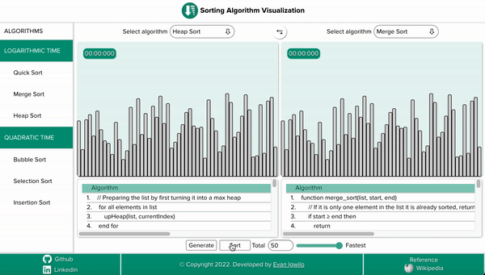

# Sorting algorithm visualizer

> This is a web application built using HTML, CSS, Javascript to visualize and understand the implementation of sorting algorithms like Quick Sort, MergeSort, BubbleSort, Insertion, etc.

**Live Demo-** (https://evanigwilo.github.io/sort-visualizer/) 

**Source Code-** (https://github.com/evanigwilo/sort-visualizer)



## Purpose

To understand the workings of sorting algorithms and their complexities by visualizing them and to further improve my skills in
HTML, CSS, and JS.

## Installation

The app is already deployed and can be played around using this [link](https://evanigwilo.github.io/sort-visualizer/).

If you wish to run this app locally, clone this repo in your local machine and Click on Index.html.

```
$ git clone git@github.com:evanigwilo/sort-visualizer.git
$ cd sort-visualizer
$ open ./index.html
```
---

Implemented using :
- HTML 
- CSS
- Javascript

Visualizes the following sorting Algorithms :
1. **Bubble Sort**.
2. **Insertion Sort**.
3. **Selection Sort**.
4. **Merge Sort**.
5. **Quick Sort**.
6. **Heap Sort**.

Features :
- _Visualizes each sorting algorithm in action_. 
- _Compares speed and execution time of each sort methods_. 
- _Generate numbers for sorting in any order_. 
- _Includes Documentation of each sorting algorithm and complexities_. 
- _Mobile-First and Fully Responsive_. 
---

## References
> [Wikipedia](https://en.wikipedia.org/wiki/Sorting_algorithm)
---

## License

Sort Visualizer is released under the [MIT License](https://choosealicense.com/licenses/mit/)
